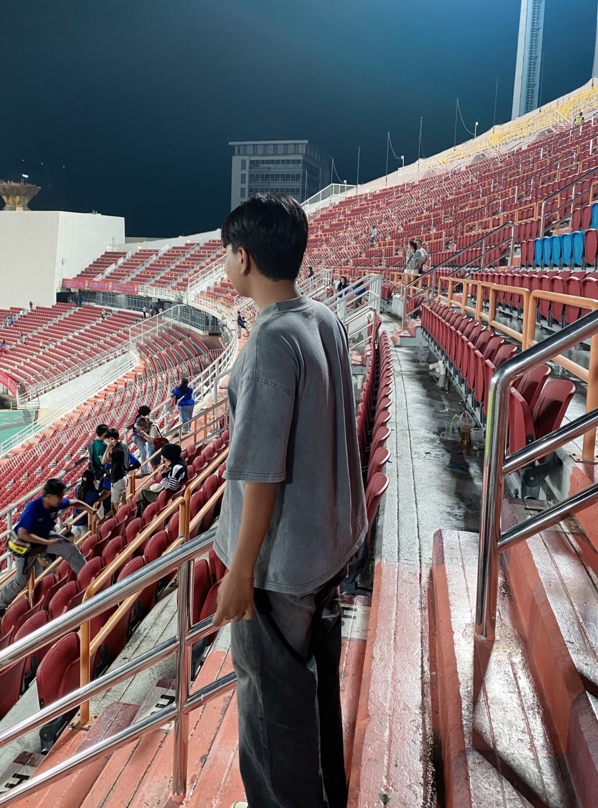

<!DOCTYPE html>
<html lang="en">
<head>
    <meta charset="UTF-8">
    <meta name="viewport" content="width=device-width, initial-scale=1.0">
    <title>Portfolio | Phuthanet Khumrat</title>
    
</head>
<body>

    <nav>
        <ul>
            <li><a href="menu.html">Menu</a></li>
            <li><a href="form.html">Form</a></li>
            <li><a href="pagelayout.html">Page Layout</a></li>
            <li><a href="BoxModel.html">Box Model</a></li>
        </ul>
    </nav>

    <section class="profile">
        
        <h1>Phuthanet Khumrat</h1>
        
Web Developer & Designer 

    </section>

    <section class="portfolio">
        <h2>My Projects</h2>
        

            

                
🔹 <a href="menu.html">Menu</a>

            

            

                
📄 <a href="form.html">Form</a>

            

            

                
📌 <a href="pagelaout.html">Page Layout</a>

            

            

                
📦 <a href="BoxModel.html">Box Model</a>

            

        

    </section>

</body>
</html>
